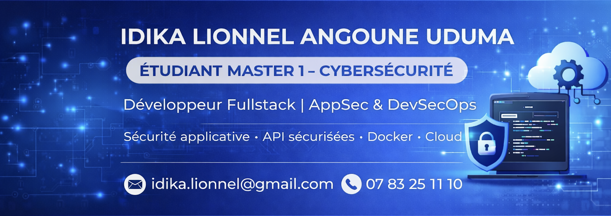

  

## 👨‍💻 Développeur Fullstack | AppSec & DevSecOps

  🔗 <strong>Portfolio :</strong> 
  👉 <a href="https://angoune-uduma.github.io/portfolio-3D/" target="_blank">
  https://angoune-uduma.github.io/portfolio-3D/
  </a>

---

## 🎯 À propos de moi

Développeur Fullstack passionné par la conception logicielle et la sécurisation applicative.  
Actuellement en **Master 1 Cybersécurité**, je m'intéresse particulièrement à :

- L’architecture sécurisée  
- La protection des API  
- Le DevSecOps  
- La conteneurisation & le cloud  

🎯 Mon objectif : construire des applications performantes, scalables et sécurisées by design.

---

## 🧠 Compétences techniques

### 👨‍💻 Frontend
- HTML, CSS, JavaScript  
- React.js  
- Vue.js  
- Android (Java / Kotlin)  

### ⚙️ Backend
- Node.js, Express.js  
- PHP, Symfony  
- C# / ASP.NET  

### 🔐 Cyber & DevSecOps
- Sécurisation API (JWT, gestion des rôles)  
- OWASP (XSS, CSRF)  
- Audit de code  
- CI/CD (GitHub Actions)  
- Docker  
- Gestion des secrets  

### ☁️ Cloud
- Google Cloud Platform  
- Microsoft Azure (AI Fundamentals)  

### 🗃️ Bases de données
- MongoDB  
- MySQL  
- NoSQL  

---

## 🛠️ Projets

### 🛡️ Audit & Sécurisation Web
- Protection contre XSS / CSRF  
- Configuration HTTPS  
- Gestion des droits d’accès  
- Sécurisation des erreurs  

### 🔐 API REST Sécurisée (App Mobile)
- Express.js, NoSQL  
- Architecture MVC  
- Authentification JWT  
- Validation des données  
- Protection des routes sensibles  

### ⚙️ Déploiement CI/CD Node.js
- Docker  
- GitHub Actions  
- Google Cloud  
- Build, tests automatisés et déploiement  

### 🌐 Application de gestion collaborative
- React.js, Node.js, MongoDB  
- Authentification et rôles  
- Dashboard dynamique  
- Architecture fullstack sécurisée  

---

## 💼 Expériences professionnelles

### Stagiaire Développement Web & SEO — Africa by Art (Paris)
*Juillet - Août 2023*
- Développement de sites web  
- Optimisation SEO  
- Intégration de fonctionnalités interactives  

### Stagiaire Développement Web — Baïfall Dream (Paris)
*Juillet - Août 2024*
- Création de sites responsifs  
- Backend Node.js  
- Optimisation SEO  

---

## 🎓 Formation

- 🎓 Baccalauréat Général – École Internationale Atlantique, Lomé (2021 - 2022)  
- 🎓 Bachelor 1 Informatique – EPSI Paris (2022 - 2023)  
- 🎓 Bachelor 2 Informatique – YNOV Lille (2023 - 2024)  
- 🎓 Bachelor 3 Informatique – SUPINFO Lille (2024 - 2025)  
- 🎓 Master 1 Cybersécurité – SUPINFO Lille (2025 - 2026)  

---

## 🌍 Langues
- Anglais : Natif  
- Français : Courant  

---

## 📬 Contact

- 💼 LinkedIn : https://www.linkedin.com/in/idika-lionnel-angoune-uduma-5a2820265/  
- 📧 Email : alexidika1@gmail.com  
- 📱 07 83 25 11 10  
